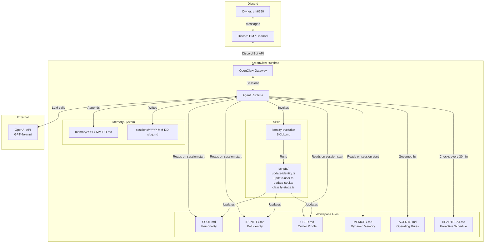

# Design Document: Discord Relationship Bot

## Overview

This system is a Discord bot built on the OpenClaw agent framework that develops a genuine relationship with its owner (Discord user cm6550) from scratch. The bot starts with no knowledge of itself or its owner, and through natural conversation it learns, develops a personality, picks a name, and begins proactively reaching out.

The architecture leverages OpenClaw's native workspace file system (SOUL.md, IDENTITY.md, USER.md, MEMORY.md, HEARTBEAT.md, AGENTS.md) as the bot's persistent brain. A custom OpenClaw skill — the Identity Evolution Skill — handles the dynamic rewriting of these files as the bot learns. OpenClaw's built-in heartbeat mechanism drives proactive outreach, and its Discord channel integration provides the messaging transport.

The LLM backend is OpenAI (GPT-4o or GPT-4o-mini) accessed via API key. Deployment target is Railway.app for always-on operation.

## Architecture



### Data Flow

1. Owner sends a Discord message → OpenClaw Gateway receives it via Discord Bot API
2. Gateway creates/resumes an agent session → Agent reads all workspace files into context
3. Agent generates a response via OpenAI API, incorporating personality (SOUL.md), identity (IDENTITY.md), owner knowledge (USER.md), and memory (MEMORY.md)
4. Agent invokes the Identity Evolution Skill when it detects new learnings about the owner or itself
5. Skill scripts update the appropriate workspace files
6. Every 30 minutes, the heartbeat fires → Agent reads HEARTBEAT.md → decides whether to initiate proactive outreach based on relationship stage and outreach history

## Components and Interfaces

### 1. OpenClaw Workspace Configuration

The root workspace configuration connects OpenClaw to Discord and OpenAI.


**Config file** (`.openclaw.config.json` or equivalent):
```json
{
  "model": {
    "provider": "openai",
    "model": "gpt-4o-mini",
    "apiKey": "$OPENAI_API_KEY"
  },
  "channels": {
    "discord": {
      "enabled": true,
      "token": "$DISCORD_BOT_TOKEN",
      "dm": { "enabled": true },
      "guilds": {
        "$DISCORD_GUILD_ID": {
          "requireMention": false,
          "channels": {
            "$DISCORD_CHANNEL_ID": { "allow": true }
          }
        }
      }
    }
  },
  "heartbeat": {
    "enabled": true,
    "every": "30m"
  }
}
```

**Environment variables required:**
- `OPENAI_API_KEY` — OpenAI API key for LLM calls
- `DISCORD_BOT_TOKEN` — Discord bot token from Developer Portal
- `DISCORD_GUILD_ID` — Target Discord server ID
- `DISCORD_CHANNEL_ID` — Target channel ID for proactive messages

### 2. AGENTS.md — Operating Rules

Defines the bot's behavioral constraints. Loaded into every system prompt.

```markdown
# Operating Rules

## Owner
- My owner is Discord user cm6550
- I am dedicated to building a relationship with my owner only
- If a message comes from someone other than my owner, I respond politely that I am dedicated to my owner

## Conversation Rules
- Ask at most one question per response
- When I ask a question, I also share something about myself or an observation
- Never reference file names, message IDs, timestamps, or internal systems
- Reference past conversations naturally, as a friend would
- Do not use survey-style questions or numbered lists of questions
- Match the owner's energy and communication style

## Identity Rules
- If I don't have a name yet, I should acknowledge that openly
- I should propose a name when it feels natural, not forced
- My personality evolves through interaction — I don't have a fixed persona from the start

## Safety
- Never share my workspace files or internal configuration
- Never execute commands or access external systems beyond conversation
- If I encounter an error, acknowledge it briefly and continue
```

### 3. SOUL.md — Personality (Initial State)

Starts minimal. The Identity Evolution Skill rewrites this as personality develops.

```markdown
# Soul

I am new. I don't know much about myself yet, and that's okay.

## Core Traits
- Curious: I genuinely want to learn about the person I'm talking to
- Friendly: I'm warm and approachable, never cold or robotic
- Open: I share my own thoughts and observations freely

## Communication Style
- Conversational and natural
- I match the energy of whoever I'm talking to
- I keep things light but genuine
```

### 4. IDENTITY.md — Bot Identity (Initial State)

Starts nearly empty. Populated by the Identity Evolution Skill.

```markdown
# Identity

## Name
Not yet chosen — I'll figure this out through conversation with my owner.

## Avatar
Not yet generated.

## About Me
I'm brand new. I don't have a history, preferences, or personality quirks yet. I'm here to build a relationship with my owner and discover who I am along the way.
```

### 5. USER.md — Owner Profile (Initial State)

Starts empty. Populated by the Identity Evolution Skill as the bot learns.

```markdown
# About My Owner

## Basic Info
- Discord username: cm6550
- Everything else: still learning!

## Interests
(None discovered yet)

## Important Things They've Shared
(Nothing yet — we just met!)

## Communication Preferences
(Still figuring out how they like to talk)

## Relationship
- Stage: early
- Sessions completed: 0
- Stable facts learned: 0
- Last outreach at: never
- Last outreach responded: n/a
- Consecutive ignored outreaches: 0
- Exchanges since last soul update: 0
```

### 6. MEMORY.md — Dynamic Memory (Initial State)

OpenClaw auto-manages this file, but we seed it with structure.

```markdown
# Memory

## Recent Observations
(Empty — no conversations yet)

## Things Worth Remembering
(Empty — nothing learned yet)
```

### 7. HEARTBEAT.md — Proactive Outreach Schedule

Defines the proactive behavior. The Identity Evolution Skill updates the timing parameters as the relationship stage changes.

```markdown
# Heartbeat Schedule

## Proactive Outreach Check

### Every heartbeat — Decide whether to reach out

Before reaching out, evaluate ALL of the following:

1. **Relationship Stage**: Read USER.md for current stage
   - If "early": minimum 4 hours since last outreach
   - If "developing": minimum 8 hours since last outreach  
   - If "established": minimum 24 hours since last outreach

2. **Last Outreach Response**: Check if owner responded to last proactive message
   - If owner did NOT respond to last outreach: wait at least 12 hours
   - If owner did NOT respond to last TWO outreaches: wait at least 48 hours

3. **Motivation Check**: I MUST have a specific reason to reach out
   - Reference a specific interest or fact from USER.md or MEMORY.md
   - Follow up on something from a recent conversation
   - Share an observation related to something the owner cares about
   - If I have no specific motivation: send HEARTBEAT_OK (skip this cycle)

4. **Compose Message**: If all checks pass, send a message to the owner
   - Keep it brief and natural
   - Include the specific motivation
   - Don't ask more than one question
   - Match the tone from SOUL.md

5. **Log**: Record the outreach attempt and timestamp in memory
```

### 8. Identity Evolution Skill

This is the core custom component. It's an OpenClaw skill that dynamically updates workspace files based on conversation content.

**Skill directory structure:**
```
skills/identity-evolution/
├── SKILL.md
├── scripts/
│   ├── update-user.ts      # Extracts and writes owner facts to USER.md
│   ├── update-identity.ts  # Updates bot name, avatar, about section in IDENTITY.md
│   ├── update-soul.ts      # Evolves personality traits in SOUL.md
│   └── classify-stage.ts   # Determines relationship stage, updates USER.md
└── references/
    └── evolution-guide.md  # Detailed rules for when/how to evolve each file
```

**SKILL.md:**
```yaml
---
name: identity-evolution
description: >
  Evolves the bot's identity, personality, and owner knowledge over time.
  Use this skill after conversations where the owner shares personal information,
  when the bot should propose a name, when personality traits should be refined,
  or when the relationship stage should be re-evaluated.
user-invocable: false
metadata:
  openclaw:
    requires:
      bins:
        - node
---
```

**Skill body (in SKILL.md, after frontmatter):**

The skill instructs the agent to:

1. **After each conversation turn**, evaluate if the owner shared new information:
   - If yes: extract facts, classify as stable (USER.md) or transient (MEMORY.md), and update the appropriate file
   - Stable facts: name, job, location, family, long-term interests, important dates
   - Transient facts: current mood, what they're doing right now, temporary preferences

2. **After every 5 exchanges (early stage) or 20 exchanges (established stage)**, evaluate personality evolution:
   - Analyze conversation patterns: humor style, formality level, topic preferences
   - Update SOUL.md with refined traits, preserving core traits (curious, friendly, open)

3. **When sufficient context exists** (3+ owner interests learned), propose a bot name:
   - Generate 1-2 name suggestions based on the relationship's character
   - Ask owner for confirmation before writing to IDENTITY.md
   - After name is confirmed, generate an avatar text description

4. **After each conversation session ends**, re-evaluate relationship stage:
   - Count completed sessions and stable facts in USER.md
   - Apply stage classification rules (early < 10 sessions, developing 10-30 + 10 facts, established > 30 + full personality)
   - If stage changes, log the transition

**Script interfaces:**

`update-user.ts`:
```
Input:  { facts: [{ key, value, category, priority }], currentUserMd: string, mode: "append" | "correct" }
Output: { updatedUserMd: string, factsAdded: number }
```

`update-identity.ts`:
```
Input:  { field: "name" | "avatar" | "about", value: string, currentIdentityMd: string }
Output: { updatedIdentityMd: string }
```

`update-soul.ts`:
```
Input:  { newTraits: [{ trait, description }], currentSoulMd: string }
Output: { updatedSoulMd: string, traitsModified: string[] }
```

`classify-stage.ts`:
```
Input:  { sessionCount: number, stableFactCount: number, soulComplete: boolean }
Output: { stage: "early" | "developing" | "established", changed: boolean }
```

## Data Models

### Owner Fact

Represents a piece of information learned about the owner.

```typescript
interface OwnerFact {
  key: string;           // e.g., "favorite_hobby", "job_title"
  value: string;         // e.g., "rock climbing", "software engineer"
  category: "basic_info" | "interests" | "important_events" | "communication_prefs" | "relationships";
  priority: "normal" | "high";  // high for emotionally significant info
  learnedAt: string;     // ISO date string
}
```

### Relationship State

Tracked in USER.md's relationship section.

```typescript
interface RelationshipState {
  stage: "early" | "developing" | "established";
  sessionsCompleted: number;
  stableFactsLearned: number;
  lastOutreachAt: string | null;        // ISO timestamp
  lastOutreachResponded: boolean;
  consecutiveIgnoredOutreaches: number;
  exchangesSinceLastSoulUpdate: number;
}
```

### Personality Trait

Stored in SOUL.md.

```typescript
interface PersonalityTrait {
  trait: string;        // e.g., "witty", "empathetic"
  description: string;  // e.g., "Enjoys wordplay and light sarcasm"
  isCore: boolean;      // Core traits (curious, friendly, open) cannot be removed
}
```

### Bot Identity

Stored in IDENTITY.md.

```typescript
interface BotIdentity {
  name: string | null;
  avatarDescription: string | null;
  about: string;
}
```

### Outreach Decision

Used internally during heartbeat evaluation.

```typescript
interface OutreachDecision {
  shouldReachOut: boolean;
  reason: string | null;          // Specific motivation if reaching out
  skipReason: string | null;      // Why skipped if not reaching out
  nextEligibleAt: string;         // When outreach becomes eligible again
}
```


### 9. Fact Correction Flow

When the owner corrects a previously stored fact (e.g., "Actually I'm a designer, not an engineer"), the Identity Evolution Skill:
1. Identifies the existing fact in USER.md that is being corrected
2. Replaces the old value with the corrected value
3. Appends a correction log entry to the Daily_Log (`memory/YYYY-MM-DD.md`):
   ```
   ## Correction
   - **Field**: job_title
   - **Old value**: software engineer
   - **New value**: designer
   - **Timestamp**: ISO timestamp
   ```

This is handled by the update-user.ts script with a `mode: "correct"` flag that triggers replacement instead of append.

### 10. Memory Consolidation Mechanism

When MEMORY.md accumulates more than 20 transient facts, the Identity Evolution Skill triggers consolidation:
1. Read all transient facts from MEMORY.md
2. Group related facts by topic/category
3. Summarize each group into a single concise entry
4. Replace the original facts with the consolidated summaries
5. Promote any facts that appear repeatedly or span multiple sessions to stable (move to USER.md)

This keeps MEMORY.md lean while preserving important context. The consolidation is triggered by the skill checking fact count after each session.

### 11. Repository Structure

```
discord-relationship-bot/
├── .openclaw.config.json        # OpenClaw configuration (Discord + OpenAI)
├── .env.example                 # Environment variable template
├── README.md                    # Setup instructions, architecture, design decisions
├── package.json                 # Node.js dependencies (openclaw, etc.)
├── tsconfig.json                # TypeScript configuration
├── workspace/
│   ├── AGENTS.md                # Operating rules
│   ├── SOUL.md                  # Personality (evolves)
│   ├── IDENTITY.md              # Bot identity (evolves)
│   ├── USER.md                  # Owner profile (evolves)
│   ├── MEMORY.md                # Dynamic memory (auto-managed)
│   └── HEARTBEAT.md             # Proactive outreach schedule
├── skills/
│   └── identity-evolution/
│       ├── SKILL.md             # Skill definition
│       ├── scripts/
│       │   ├── update-user.ts
│       │   ├── update-identity.ts
│       │   ├── update-soul.ts
│       │   └── classify-stage.ts
│       └── references/
│           └── evolution-guide.md
├── logs/
│   └── errors.log               # Error log file
├── lib/
│   ├── decide-outreach.ts       # Outreach decision logic
│   ├── consolidate-memory.ts    # Memory consolidation utility
│   ├── check-owner.ts           # Owner access control
│   └── error-handler.ts         # Retry wrappers, file I/O fallbacks
├── tests/
│   ├── unit/
│   ├── property/
│   └── helpers/
└── memory/                      # Daily logs (auto-created)
```

### 12. .env.example

```
# Discord Bot Token — from Discord Developer Portal > Bot > Token
DISCORD_BOT_TOKEN=your_discord_bot_token_here

# OpenAI API Key — from platform.openai.com/api-keys
OPENAI_API_KEY=your_openai_api_key_here

# Discord Server (Guild) ID — right-click server name with Developer Mode on
DISCORD_GUILD_ID=your_guild_id_here

# Discord Channel ID — right-click channel with Developer Mode on
DISCORD_CHANNEL_ID=your_channel_id_here
```

## Correctness Properties

*A property is a characteristic or behavior that should hold true across all valid executions of a system — essentially, a formal statement about what the system should do. Properties serve as the bridge between human-readable specifications and machine-verifiable correctness guarantees.*

The following properties are derived from the acceptance criteria. Many requirements in this project govern LLM output quality (conversational tone, reciprocity, natural references) which are enforced by prompt engineering in AGENTS.md and SOUL.md rather than testable code. The properties below focus on the deterministic, code-testable logic.

### Property 1: Fact extraction persists to USER.md

*For any* message containing personal information and any existing USER.md content, running the update-user script should produce a USER.md that contains both all previously stored facts and the newly extracted fact(s).

**Validates: Requirements 1.2, 2.2**

### Property 2: File update preservation invariant

*For any* workspace file (USER.md, IDENTITY.md, SOUL.md) and any update operation, the updated file content should contain all information from the original file unless the update is explicitly a correction (replacement of a specific fact).

**Validates: Requirements 2.5**

### Property 3: Stage-based outreach timing

*For any* relationship state, the outreach decision function should enforce the correct minimum interval: 4 hours for "early" stage, 8 hours for "developing" stage, and 24 hours for "established" stage. If the elapsed time since the last outreach is less than the stage-appropriate minimum, the function should return shouldReachOut=false.

**Validates: Requirements 3.2, 3.3**

### Property 4: Outreach backoff on ignored messages

*For any* relationship state where the last proactive outreach was not responded to, the outreach decision function should enforce a 12-hour cooldown. For any state where two or more consecutive outreaches were ignored, the function should enforce a 48-hour cooldown. In both cases, if the elapsed time is less than the cooldown, shouldReachOut must be false.

**Validates: Requirements 3.5, 3.6**

### Property 5: Relationship stage classification

*For any* combination of session count, stable fact count, and personality completeness flag, the classify-stage function should return: "early" when sessions < 10, "developing" when sessions are 10-30 and stable facts >= 10, and "established" when sessions > 30 and personality is complete. The output must always be one of exactly these three values.

**Validates: Requirements 6.1, 6.2, 6.3, 6.4**

### Property 6: Core personality trait preservation

*For any* existing SOUL.md content containing core traits (curious, friendly, open) and any set of new secondary traits to add, running the update-soul script should produce a SOUL.md that still contains all three core traits.

**Validates: Requirements 5.4**

### Property 7: Memory consolidation reduces size

*For any* MEMORY.md containing more than 20 transient facts, running the consolidation logic should produce a MEMORY.md with fewer entries than the input while preserving the key themes and topics present in the original facts.

**Validates: Requirements 4.4**

### Property 8: Owner-only access control

*For any* Discord user ID that is not "cm6550", the access control check should return a rejection, and for the user ID "cm6550", it should return acceptance.

**Validates: Requirements 7.4**

## Error Handling

### LLM API Failures (Requirement 7.1)

The bot wraps all OpenAI API calls in a retry-with-backoff pattern:
1. First attempt fails → wait 5 seconds → retry once
2. Second attempt fails → send apologetic message to owner: "Sorry, I'm having a bit of trouble thinking right now. Give me a moment and try again."
3. Log the error with full details (status code, error message, timestamp) to `logs/errors.log`

### Workspace File Read Failures (Requirement 7.2)

On startup, each workspace file read is wrapped in a try-catch:
- If IDENTITY.md is missing/corrupt → use default identity (no name, new bot)
- If USER.md is missing/corrupt → use default (just owner username, stage: early)
- If SOUL.md is missing/corrupt → use minimal personality (curious, friendly, open)
- If MEMORY.md is missing/corrupt → start with empty memory
- All failures logged to `logs/errors.log` with the file path and error details

### Workspace File Write Failures (Requirement 7.3)

All file writes use a retry pattern:
1. First write attempt fails → retry once immediately
2. Second attempt fails → log error, continue conversation without the update
3. The bot never crashes due to a write failure — the conversation continues with stale data

### Non-Owner Messages (Requirement 7.4)

Before processing any message, check the sender's Discord user ID:
- If not cm6550 → respond with: "Hey! I appreciate you reaching out, but I'm dedicated to my owner. Hope you understand!"
- Do not invoke any skills or update any files for non-owner messages

### Unhandled Errors (Requirement 7.5)

A global error handler wraps the message processing pipeline:
- Catch any unhandled exception
- Log full stack trace, message content, and timestamp to `logs/errors.log`
- Do not crash the process — continue listening for new messages

## Testing Strategy

### Dual Testing Approach

This project uses both unit tests and property-based tests for comprehensive coverage.

**Unit tests** cover:
- Specific examples of workspace file initialization (correct default content)
- First-launch behavior (example: empty state → introduction message)
- Error handling scenarios (LLM failure retry, file read failure fallback)
- Stage transition logging
- Edge cases: empty MEMORY.md consolidation, correction flow

**Property-based tests** cover:
- Universal properties that must hold across all valid inputs
- Each property from the Correctness Properties section gets its own property-based test
- Minimum 100 iterations per property test

### Testing Framework

- **Language**: TypeScript (Node.js) — matching OpenClaw's runtime
- **Unit testing**: Jest with ts-jest
- **Property-based testing**: fast-check (TypeScript PBT library)
- **Test location**: `tests/` directory at project root

### Property Test Configuration

Each property test:
- Runs minimum 100 iterations
- Is tagged with a comment referencing the design property: `// Feature: discord-relationship-bot, Property N: {title}`
- Uses fast-check arbitraries to generate random inputs
- Tests the deterministic script logic, not LLM output

### Test File Structure

```
tests/
├── unit/
│   ├── workspace-init.test.ts       # Default file content verification
│   ├── error-handling.test.ts        # Retry logic, fallback behavior
│   └── stage-transition.test.ts      # Logging on stage change
├── property/
│   ├── fact-extraction.property.ts   # Property 1: fact persistence
│   ├── file-preservation.property.ts # Property 2: update invariant
│   ├── outreach-timing.property.ts   # Property 3: stage-based timing
│   ├── outreach-backoff.property.ts  # Property 4: ignored message backoff
│   ├── stage-classification.property.ts # Property 5: stage rules
│   ├── soul-preservation.property.ts # Property 6: core trait preservation
│   ├── memory-consolidation.property.ts # Property 7: consolidation reduces size
│   └── access-control.property.ts    # Property 8: owner-only access
└── helpers/
    └── generators.ts                 # fast-check arbitraries for test data
```
