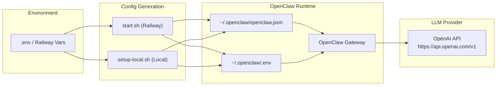

# Design Document: OpenAI Migration

## Overview

This design covers migrating the LLM provider configuration from OpenRouter to OpenAI across the Discord Relationship Bot codebase. The bot uses the OpenClaw framework, which handles actual HTTP communication with the LLM API — our changes are purely configuration-level: environment variables, shell script config generation, TypeScript env validation, and documentation.

The migration touches six files across two runtime environments (Railway deployment and local development), with no changes to application logic, skills, or workspace files.

## Architecture

The bot's LLM integration is indirect — OpenClaw reads a config file (`~/.openclaw/openclaw.json`) and a runtime `.env` file to determine which provider to call. The shell scripts generate these files from environment variables.



There is no abstraction layer or adapter pattern needed — the change is a direct substitution of provider name, base URL, API key variable, and model identifiers in the config templates embedded in the shell scripts.

## Components and Interfaces

### Component 1: Environment Template (`.env.example`)

Defines the required environment variables for operators. Changes:
- Replace `OPENROUTER_API_KEY=your_openrouter_api_key_here` with `OPENAI_API_KEY=your_openai_api_key_here`
- Update the comment from OpenRouter reference to OpenAI reference

### Component 2: Startup Script (`start.sh`)

Generates `~/.openclaw/openclaw.json` and `~/.openclaw/.env` for Railway/VPS deployment. Changes:

1. **Debug output**: Change `OPENROUTER_API_KEY` debug line to `OPENAI_API_KEY`
2. **Validation**: Check for `OPENAI_API_KEY` instead of `OPENROUTER_API_KEY`
3. **Provider block**: Replace `openrouter` provider with `openai` provider:
   ```json
   "providers": {
     "openai": {
       "apiKey": "${OPENAI_API_KEY}",
       "baseUrl": "https://api.openai.com/v1",
       "models": []
     }
   }
   ```
4. **Model references**: Replace primary model with `openai/gpt-5.4-nano`, remove fallbacks array
5. **Runtime .env**: Write `OPENAI_API_KEY` instead of `OPENROUTER_API_KEY`
6. **Echo output**: Update the model confirmation message

### Component 3: Setup Script (`setup-local.sh`)

Generates the same config files for local development. Identical changes as `start.sh`:

1. **Validation**: Check for `OPENAI_API_KEY` instead of `OPENROUTER_API_KEY` (including placeholder check against `your_openai_api_key_here`)
2. **Provider block**: Same `openai` provider substitution
3. **Model references**: Same `openai/gpt-5.4-nano` primary, no fallbacks
4. **Runtime .env**: Write `OPENAI_API_KEY` instead of `OPENROUTER_API_KEY`

### Component 4: Entry Point (`index.ts`)

The `checkEnvVars()` function already checks for `OPENAI_API_KEY`. Verify no stale `OPENROUTER_API_KEY` references exist anywhere in the file.

### Component 5: Documentation (`README.md`)

Update all OpenRouter references:
- Prerequisites section: OpenAI API key instead of OpenRouter
- Local setup `.env` example block
- Railway deployment environment variables table
- Architecture diagram: `OpenAI API` label instead of `OpenRouter API`
- Remove `openrouter.ai/keys` link, replace with OpenAI platform link

## Data Models

### OpenClaw Config Provider Block (Before)

```json
{
  "models": {
    "mode": "merge",
    "providers": {
      "openrouter": {
        "apiKey": "${OPENROUTER_API_KEY}",
        "baseUrl": "https://openrouter.ai/api/v1",
        "models": []
      }
    }
  }
}
```

### OpenClaw Config Provider Block (After)

```json
{
  "models": {
    "mode": "merge",
    "providers": {
      "openai": {
        "apiKey": "${OPENAI_API_KEY}",
        "baseUrl": "https://api.openai.com/v1",
        "models": []
      }
    }
  }
}
```

### Model Reference (Before)

```json
{
  "model": {
    "primary": "openrouter/nvidia/nemotron-3-super-120b-a12b:free",
    "fallbacks": [
      "openrouter/meta-llama/llama-3.3-70b-instruct:free",
      "openrouter/google/gemma-3-27b-it:free"
    ]
  }
}
```

### Model Reference (After)

```json
{
  "model": {
    "primary": "openai/gpt-5.4-nano"
  }
}
```

### Environment Variables (Before → After)

| Variable | Before | After |
|----------|--------|-------|
| LLM API Key | `OPENROUTER_API_KEY` | `OPENAI_API_KEY` |


## Correctness Properties

*A property is a characteristic or behavior that should hold true across all valid executions of a system — essentially, a formal statement about what the system should do. Properties serve as the bridge between human-readable specifications and machine-verifiable correctness guarantees.*

The shell scripts generate JSON config from environment variables. The key testable properties involve generating the config with arbitrary valid env var values and verifying the output structure. We can simulate config generation by extracting the heredoc template logic into a testable function, or by running the scripts with mock env vars and parsing the output.

Many acceptance criteria (especially around `.env.example`, `README.md`, and `index.ts`) are static content checks best verified as unit test examples rather than properties. The properties below focus on the generated config, which varies with input.

### Property 1: Generated config is valid JSON

*For any* set of valid environment variable values (DISCORD_BOT_TOKEN, OPENAI_API_KEY, DISCORD_GUILD_ID, DISCORD_CHANNEL_ID), running either the Startup_Script or Setup_Script config generation logic should produce output that parses as valid JSON without errors.

**Validates: Requirements 6.1, 6.2**

### Property 2: Provider key is openai

*For any* set of valid environment variable values, the generated OpenClaw_Config should have `openai` as the only key under `models.providers`, and should not contain `openrouter` as a provider key.

**Validates: Requirements 2.1, 2.4**

### Property 3: Provider base URL is OpenAI endpoint

*For any* set of valid environment variable values, the generated OpenClaw_Config provider entry should have `baseUrl` set to `https://api.openai.com/v1`.

**Validates: Requirements 2.2, 2.5**

### Property 4: Model config uses gpt-5.4-nano with no fallbacks

*For any* set of valid environment variable values, the generated OpenClaw_Config should set the primary model to `openai/gpt-5.4-nano` and should not contain a `fallbacks` array in the model configuration.

**Validates: Requirements 3.1, 3.2, 3.3, 3.4**

### Property 5: Provider entry has complete structure

*For any* set of valid environment variable values, the generated OpenClaw_Config should contain exactly one provider entry under `models.providers`, and that entry should contain `apiKey`, `baseUrl`, and `models` fields.

**Validates: Requirements 6.3, 6.4**

## Error Handling

This migration is a configuration substitution with no new error paths introduced. Existing error handling remains unchanged:

- **Missing env vars**: Both scripts already validate required env vars and exit with a descriptive error. The validation list changes from `OPENROUTER_API_KEY` to `OPENAI_API_KEY` but the mechanism is identical.
- **Invalid API key**: OpenClaw handles API authentication errors at runtime. No change needed.
- **`index.ts` validation**: The `checkEnvVars()` function already checks for `OPENAI_API_KEY` and logs missing vars. No change needed to error handling logic.
- **Setup script placeholder detection**: `setup-local.sh` checks for placeholder values (e.g., `your_openrouter_api_key_here`). This needs to be updated to `your_openai_api_key_here` to match the new `.env.example`.

## Testing Strategy

### Property-Based Tests (fast-check)

The project already uses `fast-check` with Jest. Property tests will validate that the config generation logic produces correct output for arbitrary valid environment variable values.

**Approach**: Extract the config generation logic into a testable TypeScript function that takes env var values as input and returns the JSON config string. This avoids shelling out to bash in tests while testing the same template logic.

Each property test will:
- Generate random strings for env var values using `fc.string()`
- Call the config generation function
- Parse the output and assert the property

**Configuration**: Minimum 100 iterations per property test.

**Tag format**: `Feature: openai-migration, Property N: <property text>`

**Library**: `fast-check` (already installed as devDependency)

### Unit Tests (Jest)

Unit tests will verify static content correctness as specific examples:

- `.env.example` contains `OPENAI_API_KEY` and not `OPENROUTER_API_KEY`
- `start.sh` validates `OPENAI_API_KEY` (grep for the variable in validation block)
- `setup-local.sh` validates `OPENAI_API_KEY`
- `index.ts` `checkEnvVars()` includes `OPENAI_API_KEY` in required list
- `README.md` contains `OPENAI_API_KEY` and not `OPENROUTER_API_KEY`
- No file in the project contains `OPENROUTER` references after migration

### Test Organization

```
tests/
├── property/
│   └── config-generation.property.ts    # Properties 1-5
└── unit/
    └── openai-migration.test.ts         # Static content verification
```
