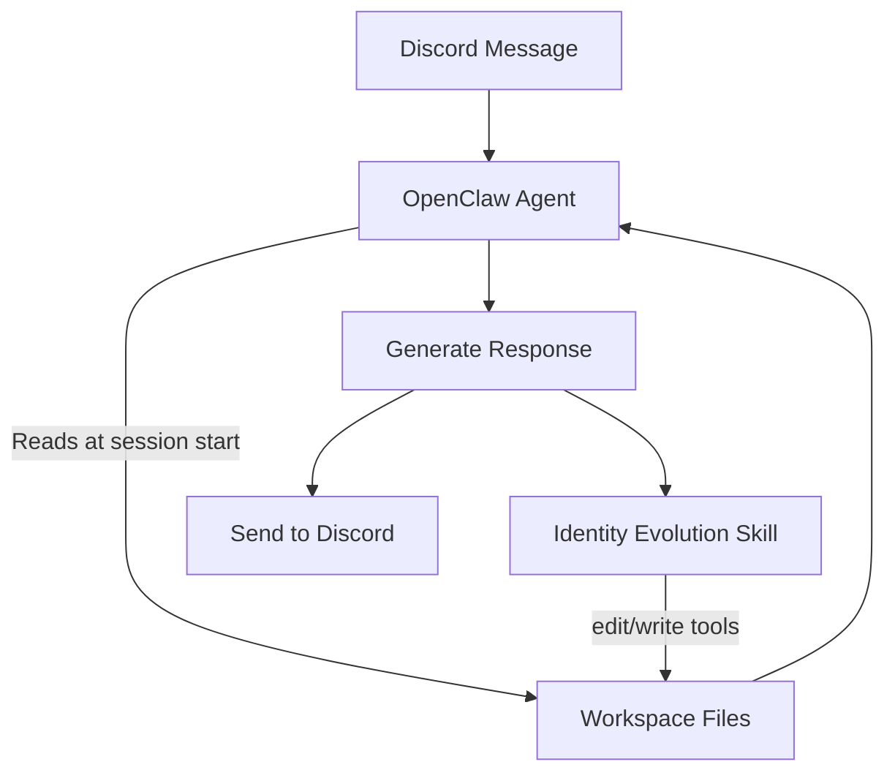

# Design Document: Workspace Cleanup

## Overview

This refactoring addresses two issues in the Discord Relationship Bot:

1. **Duplicate skill removal**: Delete the root-level `skills/` directory, keep `workspace/skills/` as the single source of truth, and update all import paths in tests and documentation.

2. **Strengthen agent instructions**: Rewrite the AGENTS.md and SKILL.md files to include explicit pre-response read checklists, post-response write checklists, concrete edit tool examples, and a mandatory minimum-write rule so the OpenClaw agent reliably reads and updates workspace files every turn.

No new runtime modules are introduced. The OpenClaw agent already has the `edit`/`write` tools and the skill system. The problem is that the instructional text is not strong or structured enough for the LLM to follow reliably. The fix is better prompting, not new code.

## Architecture

The architecture does not change. The refactoring is structural (file deletion, path updates) and content-based (instruction rewriting). The existing flow remains:



The key change is that the instructions in AGENTS.md and SKILL.md become more explicit and structured, so the agent follows the read-before-respond and write-after-respond pattern reliably.

## Components and Interfaces

### 1. File Deletion: `skills/` Directory

The entire `skills/` directory at the project root is deleted. This directory contains:
- `skills/identity-evolution/SKILL.md`
- `skills/identity-evolution/scripts/classify-stage.ts`
- `skills/identity-evolution/scripts/update-user.ts`
- `skills/identity-evolution/scripts/update-identity.ts`
- `skills/identity-evolution/scripts/update-soul.ts`
- `skills/identity-evolution/references/evolution-guide.md`

All of these are byte-identical to their counterparts in `workspace/skills/identity-evolution/`.

### 2. Test Import Path Updates

Six test files import from `../../skills/identity-evolution/scripts/`:

| Test File | Import |
|-----------|--------|
| `tests/unit/update-user.test.ts` | `update-user` |
| `tests/unit/classify-stage.test.ts` | `classify-stage` |
| `tests/property/file-preservation.property.ts` | `update-user` |
| `tests/property/stage-classification.property.ts` | `classify-stage` |
| `tests/property/soul-preservation.property.ts` | `update-soul` |
| `tests/property/fact-extraction.property.ts` | `update-user` |

Each import path changes from:
```typescript
// Before
import { updateUser } from '../../skills/identity-evolution/scripts/update-user';
// After
import { updateUser } from '../../workspace/skills/identity-evolution/scripts/update-user';
```

### 3. AGENTS.md Rewrite

The `workspace/AGENTS.md` file is updated with:

**Pre-response section** (new):
```markdown
## MANDATORY: Read Context Before Every Response
Before generating ANY response, you MUST read these files to restore your memory:
1. `USER.md` — Who your owner is, their interests, relationship stage
2. `IDENTITY.md` — Your name and identity
3. `SOUL.md` — Your personality traits
4. `MEMORY.md` — Recent observations and transient facts

Do NOT respond until you have read these files. Your memory resets between sessions.
```

**Post-response section** (strengthened from existing):
The existing "CRITICAL: Memory Updates" section is restructured into a numbered checklist with concrete `edit` tool examples for each update type. A mandatory minimum-write rule is added: the agent must use the `edit` tool at least once per turn, even if only to timestamp MEMORY.md.

**File reference table** (new):
A table listing each workspace file, what it contains, and when to read/write it.

### 4. SKILL.md Rewrite

The `workspace/skills/identity-evolution/SKILL.md` is updated with:

**Pre-response checklist** (new):
A numbered list the agent follows before generating any reply, ensuring all workspace files are read.

**Post-response decision tree** (strengthened):
The existing "After EVERY Conversation Turn" section is restructured into a strict decision tree with explicit conditions and `edit` tool call examples.

**Mandatory minimum write** (new):
```markdown
## Mandatory Write Rule
You MUST call the `edit` tool at least once after every conversation turn.
If no new facts, identity changes, or personality evolution occurred, update MEMORY.md:
- Add a timestamped entry under "## Recent Observations": `- [timestamp] No new information from this exchange`
```

### 5. README.md Update

The project structure tree in README.md is updated to:
- Remove the `skills/` entry
- Show `workspace/skills/` as the only skill location
- Add a note that `workspace/skills/` is the canonical location for OpenClaw skills

The architecture description (the "How It Works" section and Mermaid diagram) is updated to mention that workspace files are read before every response and updated after every conversation turn, reflecting the strengthened instruction pattern.

## Data Models

No new data models are introduced. The existing interfaces in `workspace/skills/identity-evolution/scripts/update-user.ts` remain unchanged:

```typescript
// Existing — no changes
interface OwnerFact {
  key: string;
  value: string;
  category: FactCategory;
  priority: 'normal' | 'high';
}

interface UpdateUserInput {
  facts: OwnerFact[];
  currentUserMd: string;
  mode: 'append' | 'correct';
}

interface UpdateUserOutput {
  updatedUserMd: string;
  factsAdded: number;
  correctionLog?: string;
}
```

The workspace file structure (SOUL.md, IDENTITY.md, USER.md, MEMORY.md, HEARTBEAT.md, AGENTS.md, TOOLS.md) also remains unchanged. Only the content of AGENTS.md and SKILL.md changes.


## Correctness Properties

*A property is a characteristic or behavior that should hold true across all valid executions of a system — essentially, a formal statement about what the system should do. Properties serve as the bridge between human-readable specifications and machine-verifiable correctness guarantees.*

### Property 1: Test imports reference canonical skill location

*For any* test file in `tests/unit/` or `tests/property/` that imports from the identity-evolution skill scripts, the import path SHALL resolve to `workspace/skills/identity-evolution/scripts/` and SHALL NOT contain a bare `skills/identity-evolution/scripts/` path (without the `workspace/` prefix).

**Validates: Requirements 1.3, 4.1, 6.3**

### Property 2: AGENTS.md references all workspace files

*For any* workspace file in the set {SOUL.md, IDENTITY.md, USER.md, MEMORY.md}, the AGENTS.md file SHALL contain the filename and a non-empty description string on the same line or adjacent line.

**Validates: Requirements 2.3**

### Property 3: SKILL.md contains decision tree for each managed file

*For any* managed workspace file in the set {USER.md, IDENTITY.md, SOUL.md, MEMORY.md}, the SKILL.md file SHALL contain a section or subsection that names that file and specifies at least one condition under which the agent writes to it.

**Validates: Requirements 3.2**

### Property 4: AGENTS.md contains edit tool examples for each update type

*For any* update type in the set {fact addition, identity change, personality evolution, transient observation}, the AGENTS.md file SHALL contain a concrete `edit` tool usage example demonstrating that update type.

**Validates: Requirements 3.3**

## Error Handling

This refactoring is primarily structural (file deletion, path updates, content rewriting). Error handling considerations:

1. **Missing workspace files at startup**: The existing `index.ts` `ensureWorkspaceFiles()` function already handles this by creating files with default content. No changes needed.

2. **Import resolution after path changes**: If any test import path is missed during the update, the test suite will fail with a module-not-found error. The property test (Property 1) catches this by scanning all test files.

3. **File read/write failures in the agent**: The existing `readFileWithFallback` and `logError` utilities in `lib/error-handler.ts` handle file I/O errors. The strengthened SKILL.md instructions do not change the error handling behavior — they only make the agent more likely to actually call the edit tool.

## Testing Strategy

### Existing Tests (must continue passing)

All existing tests remain valid after the refactoring. The only change is updating import paths from `../../skills/identity-evolution/scripts/` to `../../workspace/skills/identity-evolution/scripts/`.

- **Unit tests** (`tests/unit/`): `workspace-init.test.ts`, `classify-stage.test.ts`, `update-user.test.ts`, `error-handling.test.ts`
- **Property tests** (`tests/property/`): `file-preservation.property.ts`, `stage-classification.property.ts`, `soul-preservation.property.ts`, `fact-extraction.property.ts`, `access-control.property.ts`, `memory-consolidation.property.ts`, `outreach-backoff.property.ts`, `outreach-timing.property.ts`

### New Tests

**Property-based tests** (using fast-check):

- **Property 1 test**: Scan all `.ts` files in `tests/` for import statements matching `skills/identity-evolution`. Assert that every match is prefixed with `workspace/`. Run with 100+ iterations (though this is effectively a static scan, the property framework ensures completeness).

- **Property 2 test**: For each workspace file in the managed set, assert AGENTS.md contains the filename with a description.

- **Property 3 test**: For each managed workspace file, assert SKILL.md contains a decision tree section for that file.

- **Property 4 test**: For each update type, assert AGENTS.md contains an edit tool example for that type.

**Unit tests**:

- Verify `skills/` directory does not exist at project root.
- Verify `workspace/skills/identity-evolution/` contains all expected files.
- Verify AGENTS.md contains the pre-response read checklist.
- Verify AGENTS.md contains the post-response write checklist.
- Verify SKILL.md contains the mandatory minimum write rule.
- Verify README.md project structure tree does not reference root-level `skills/`.

### Test Configuration

- Framework: Jest + ts-jest
- Property testing: fast-check
- Minimum 100 iterations per property test
- Each property test tagged with: `Feature: workspace-cleanup, Property {N}: {title}`
