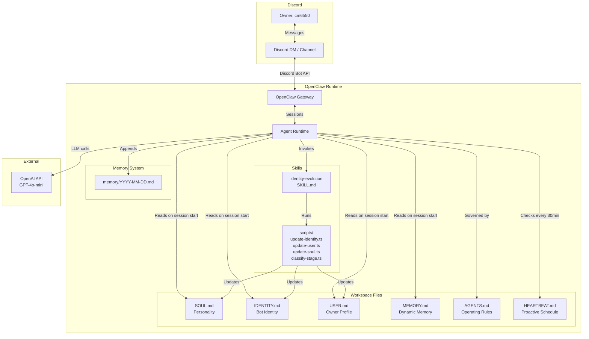

# Discord Relationship Bot 🦞

A Discord bot built on [OpenClaw](https://github.com/nichochar/openclaw) that develops a genuine relationship with its owner from scratch. It starts with no name, no personality, and no knowledge — and grows into a unique companion through natural conversation.

## How It Works

The bot uses OpenClaw's workspace file system as its persistent brain:

- **SOUL.md** — Personality traits that evolve over time
- **IDENTITY.md** — Bot name, avatar, and self-description (starts empty, fills in through conversation)
- **USER.md** — Everything the bot learns about its owner
- **MEMORY.md** — Dynamic short-term memory, auto-consolidated when it gets large
- **HEARTBEAT.md** — Proactive outreach schedule (the bot reaches out on its own with context-driven motivation)
- **AGENTS.md** — Operating rules and behavioral constraints

A custom **Identity Evolution Skill** watches conversations and updates these files as the bot learns. It extracts facts, evolves personality traits, proposes a name when the time feels right, and tracks the relationship stage.

### Relationship Stages

| Stage | Trigger | Bot Behavior |
|-------|---------|-------------|
| **Early** | < 10 sessions | Curious, exploratory, asks open-ended questions |
| **Developing** | 10–30 sessions + 10 facts | More personal, references shared history |
| **Established** | 30+ sessions + full personality | Natural, contextual, less frequent outreach |

### Proactive Outreach

The bot doesn't just wait for messages. Every 30 minutes it checks whether to reach out, based on:
- Relationship stage (early: every 4h, developing: 8h, established: 24h)
- Whether the owner responded to the last outreach
- Whether it has a specific, motivated reason to reach out

If the owner ignores outreach, the bot backs off (12h after 1 ignore, 48h after 2+).

## Architecture



## Project Structure

```
discord-relationship-bot/
├── .openclaw.config.json        # OpenClaw config (Discord + OpenAI)
├── .env.example                 # Environment variable template
├── index.ts                     # Startup script — verifies workspace, checks env
├── package.json
├── tsconfig.json
├── workspace/                   # OpenClaw workspace (the bot's brain)
│   ├── AGENTS.md
│   ├── SOUL.md
│   ├── IDENTITY.md
│   ├── USER.md
│   ├── MEMORY.md
│   └── HEARTBEAT.md
├── skills/
│   └── identity-evolution/      # Custom skill for dynamic file updates
│       ├── SKILL.md
│       ├── scripts/
│       │   ├── update-user.ts
│       │   ├── update-identity.ts
│       │   ├── update-soul.ts
│       │   └── classify-stage.ts
│       └── references/
│           └── evolution-guide.md
├── lib/                         # Shared utilities
│   ├── decide-outreach.ts
│   ├── consolidate-memory.ts
│   ├── check-owner.ts
│   └── error-handler.ts
├── tests/
│   ├── unit/
│   └── property/
├── logs/                        # Error logs (gitignored)
└── memory/                      # Daily conversation logs (auto-created)
```

## Setup

### 1. Create a Discord Bot

1. Go to the [Discord Developer Portal](https://discord.com/developers/applications)
2. Click "New Application" and give it a name
3. Go to **Bot** → click "Add Bot"
4. Copy the bot token
5. Under **Privileged Gateway Intents**, enable **Message Content Intent**
6. Go to **OAuth2 → URL Generator**, select `bot` scope with `Send Messages` + `Read Message History` permissions
7. Use the generated URL to invite the bot to your server

### 2. Configure Environment Variables

```bash
cp .env.example .env
```

Edit `.env` with your values:

```
DISCORD_BOT_TOKEN=your_bot_token
OPENAI_API_KEY=your_openai_key
DISCORD_GUILD_ID=your_server_id
DISCORD_CHANNEL_ID=your_channel_id
```

To get guild/channel IDs: enable Developer Mode in Discord settings, then right-click the server name or channel.

### 3. Install and Run

```bash
npm install
npm start
```

The `npm start` command launches the OpenClaw gateway, which connects to Discord and starts listening for messages.

## Design Decisions

### Why OpenClaw?

OpenClaw provides the core infrastructure this bot needs out of the box:
- **Workspace files** as a persistent, human-readable state system — no database needed
- **Discord channel integration** with built-in message handling
- **Heartbeat mechanism** for proactive scheduling
- **Skill system** for extending agent behavior with custom scripts
- **Session management** for conversation continuity

Building on OpenClaw means the bot's "brain" is just markdown files you can read and edit directly.

### File-Based Memory

Instead of a database, all bot state lives in markdown files. This makes the bot's knowledge:
- **Inspectable** — open any file to see exactly what the bot knows
- **Editable** — manually correct or seed knowledge by editing files
- **Portable** — copy the workspace directory to move the bot's entire identity
- **Version-controllable** — commit state files to see how the bot evolved over time

### Skill Architecture

The Identity Evolution Skill separates "learning logic" from "conversation logic." The agent handles natural conversation; the skill handles structured file updates. Each script has a focused responsibility:
- `update-user.ts` — fact extraction and owner profile management
- `update-identity.ts` — bot name, avatar, and self-description
- `update-soul.ts` — personality trait evolution (preserves core traits)
- `classify-stage.ts` — relationship stage transitions

### Proactive Outreach Design

The bot's outreach is motivation-driven, not timer-driven. It only reaches out when it has something specific to say (a follow-up, a reference to a shared interest). Combined with backoff logic for ignored messages, this prevents the bot from feeling spammy.

## Deployment (Railway.app)

The repo includes a `Dockerfile` and `railway.json` for one-click Railway deployment.

1. Push the repo to GitHub
2. Create a new project on [Railway](https://railway.app)
3. Click "Deploy from GitHub repo" and connect your repository
4. Railway will detect the Dockerfile and build automatically
5. Add these environment variables in Railway's dashboard (Settings → Variables):

| Variable | Description |
|----------|-------------|
| `DISCORD_BOT_TOKEN` | Bot token from Discord Developer Portal |
| `OPENAI_API_KEY` | OpenAI API key |
| `DISCORD_GUILD_ID` | Your Discord server ID |
| `DISCORD_CHANNEL_ID` | Channel ID for the bot to operate in |

6. Deploy — Railway builds the Docker image, injects env vars, and starts the OpenClaw gateway
7. The bot runs 24/7 with automatic restarts on failure

The `start.sh` script generates the OpenClaw config at runtime from Railway's environment variables, so no secrets are baked into the image.

## Testing

```bash
npm test
```

Tests use Jest with ts-jest and fast-check for property-based testing. The test suite covers:
- Workspace file initialization and defaults
- Relationship stage classification logic
- Outreach timing and backoff rules
- Fact extraction and file preservation
- Core personality trait preservation
- Memory consolidation
- Owner access control
- Error handling (retry logic, file fallbacks)
