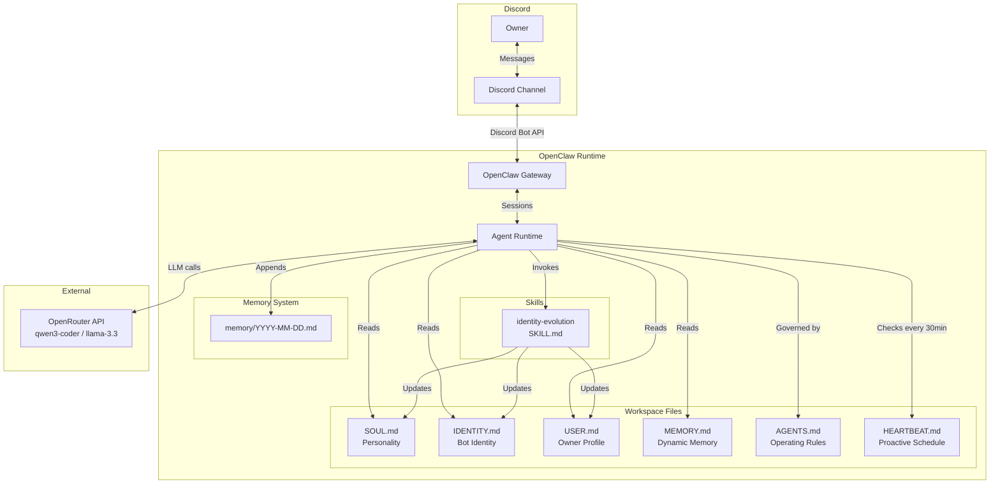

# Discord Relationship Bot 🦞

A Discord bot built on [OpenClaw](https://github.com/openclaw/openclaw) that develops a genuine relationship with its owner from scratch. It starts with no name, no personality, and no knowledge — and grows into a unique companion through natural conversation.

## How It Works

The bot uses OpenClaw's workspace file system as its persistent brain:

- **SOUL.md** — Personality traits that evolve over time
- **IDENTITY.md** — Bot name, avatar, and self-description (starts empty, fills in through conversation)
- **USER.md** — Everything the bot learns about its owner
- **MEMORY.md** — Dynamic short-term memory, auto-consolidated when it gets large
- **HEARTBEAT.md** — Proactive outreach schedule (the bot reaches out on its own with context-driven motivation)
- **AGENTS.md** — Operating rules and behavioral constraints

A custom **Identity Evolution Skill** watches conversations and updates these files as the bot learns. It extracts facts silently, evolves personality traits, proposes a name when the time feels right, and tracks the relationship stage. Memory happens naturally — the bot never asks "should I remember this?"

### Relationship Stages

| Stage | Trigger | Bot Behavior |
|-------|---------|-------------|
| **Early** | < 10 sessions | Curious, exploratory, asks open-ended questions |
| **Developing** | 10–30 sessions + 10 facts | More personal, references shared history |
| **Established** | 30+ sessions + full personality | Natural, contextual, less frequent outreach |

### Proactive Outreach

The bot doesn't just wait for messages. Every 30 minutes it checks whether to reach out, based on:
- Whether at least 30 minutes have passed since the last outreach
- Whether the owner responded to the last outreach
- Whether it has a specific, motivated reason to reach out

Backoff on ignored messages:
- 1 ignored → wait 2 hours
- 2 ignored → wait 6 hours
- 3+ ignored → wait 24 hours

## Architecture



## Project Structure

```
discord-relationship-bot/
├── Dockerfile               # Docker image for Railway deployment
├── start.sh                 # Startup script — generates OpenClaw config from env vars
├── railway.json             # Railway deployment config
├── .env.example             # Environment variable template
├── index.ts                 # Local startup script — verifies workspace, checks env
├── package.json             # Dependencies (openclaw + test tooling)
├── jest.config.js           # Jest test configuration
├── tsconfig.json            # TypeScript configuration
├── workspace/               # OpenClaw workspace (the bot's brain)
│   ├── AGENTS.md
│   ├── SOUL.md
│   ├── IDENTITY.md
│   ├── USER.md
│   ├── MEMORY.md
│   └── HEARTBEAT.md
├── skills/
│   └── identity-evolution/  # Custom skill for dynamic file updates
│       ├── SKILL.md
│       ├── scripts/
│       │   ├── update-user.ts
│       │   ├── update-identity.ts
│       │   ├── update-soul.ts
│       │   └── classify-stage.ts
│       └── references/
│           └── evolution-guide.md
├── lib/                     # Shared utilities
│   ├── decide-outreach.ts
│   ├── consolidate-memory.ts
│   ├── check-owner.ts
│   └── error-handler.ts
├── tests/
│   ├── unit/
│   └── property/
├── logs/                    # Error logs (gitignored)
└── memory/                  # Daily conversation logs (auto-created)
```

## Prerequisites

- [Node.js](https://nodejs.org/) 22+ (for local development)
- A Discord bot token ([Developer Portal](https://discord.com/developers/applications))
- An OpenRouter API key ([openrouter.ai/keys](https://openrouter.ai/keys) — free tier available)
- A Discord server with the bot invited

### Create a Discord Bot

1. Go to the [Discord Developer Portal](https://discord.com/developers/applications)
2. Click **New Application** and name it
3. Go to **Bot** → click **Reset Token** → copy the token
4. Under **Privileged Gateway Intents**, enable **Message Content Intent** and **Server Members Intent**
5. Go to **OAuth2 → URL Generator** → select `bot` scope → check `Send Messages` + `Read Message History` + `Read Messages/View Channels`
6. Open the generated URL to invite the bot to your server

### Get Discord IDs

1. In Discord, go to **Settings → Advanced → Enable Developer Mode**
2. Right-click your server name → **Copy Server ID** (Guild ID)
3. Right-click the target channel → **Copy Channel ID**

## Running Locally

### 1. Install dependencies

```bash
npm install
```

### 2. Configure environment

```bash
cp .env.example .env
```

Edit `.env`:

```
DISCORD_BOT_TOKEN=your_bot_token
OPENROUTER_API_KEY=your_openrouter_key
DISCORD_GUILD_ID=your_server_id
DISCORD_CHANNEL_ID=your_channel_id
```

### 3. Set up OpenClaw

```bash
npm run setup
```

This reads your `.env` and writes the config to `~/.openclaw/openclaw.json` (the standard OpenClaw config location), pointing the workspace to this project's `workspace/` directory.

### 4. Start the bot

```bash
npm start
```

### 5. Verify

```bash
npx openclaw channels status
```

You should see: `Discord default: enabled, configured, running, connected`

### 6. Stop the bot

```bash
npx openclaw gateway stop
```

## Deployment (Railway.app)

The repo includes a `Dockerfile` and `railway.json` for Railway deployment.

1. Push the repo to GitHub
2. Create a new project on [Railway](https://railway.app)
3. Click **Deploy from GitHub repo** and connect your repository
4. Railway detects the Dockerfile and builds automatically
5. Add these environment variables in Railway's dashboard (**Variables** tab):

| Variable | Description |
|----------|-------------|
| `DISCORD_BOT_TOKEN` | Bot token from Discord Developer Portal |
| `OPENROUTER_API_KEY` | OpenRouter API key (free tier works) |
| `DISCORD_GUILD_ID` | Your Discord server ID |
| `DISCORD_CHANNEL_ID` | Channel ID for the bot to operate in |

6. Click **Deploy** — Railway builds the Docker image, injects env vars, and starts the OpenClaw gateway
7. The bot runs 24/7 with automatic restarts on failure

The `start.sh` script generates the OpenClaw config at runtime from Railway's environment variables, so no secrets are baked into the image.

**Note:** Workspace file changes (what the bot learns) don't persist across Railway redeploys unless you attach a volume to `/app/workspace`. For the demo, this is fine — commit the updated workspace files after a conversation to show what the bot learned.

## Design Decisions

### Why OpenClaw?

OpenClaw provides the core infrastructure this bot needs out of the box:
- **Workspace files** as a persistent, human-readable state system — no database needed
- **Discord channel integration** with built-in message handling
- **Heartbeat mechanism** for proactive scheduling
- **Skill system** for extending agent behavior with custom scripts
- **Session management** for conversation continuity

Building on OpenClaw means the bot's "brain" is just markdown files you can read and edit directly.

### File-Based Memory

All bot state lives in markdown files. This makes the bot's knowledge:
- **Inspectable** — open any file to see exactly what the bot knows
- **Editable** — manually correct or seed knowledge by editing files
- **Portable** — copy the workspace directory to move the bot's entire identity
- **Version-controllable** — commit state files to see how the bot evolved over time

### Silent Memory

The bot never asks "would you like me to remember this?" Memory happens invisibly — facts are extracted from conversation and written to files in the background. When the bot references something later, it feels natural, like a friend who just remembers.

### Proactive Outreach Design

The bot's outreach is motivation-driven, not timer-driven. It only reaches out when it has something specific to say. Combined with progressive backoff on ignored messages, this prevents the bot from feeling spammy.

## Testing

```bash
npm test
```

85 tests across 12 suites using Jest + fast-check for property-based testing:
- Workspace file initialization and defaults
- Relationship stage classification logic
- Outreach timing and backoff rules
- Fact extraction and file preservation
- Core personality trait preservation
- Memory consolidation
- Owner access control
- Error handling (retry logic, file fallbacks)

## What I'd Improve With More Time

- Persistent volume on Railway so the bot's memory survives redeploys
- Image generation for the avatar (currently text description only)
- Smarter fact deduplication when the owner mentions the same thing differently
- Conversation pacing — detecting when to leave space vs. when to engage
- Multi-channel support (DMs + server channels with different contexts)
